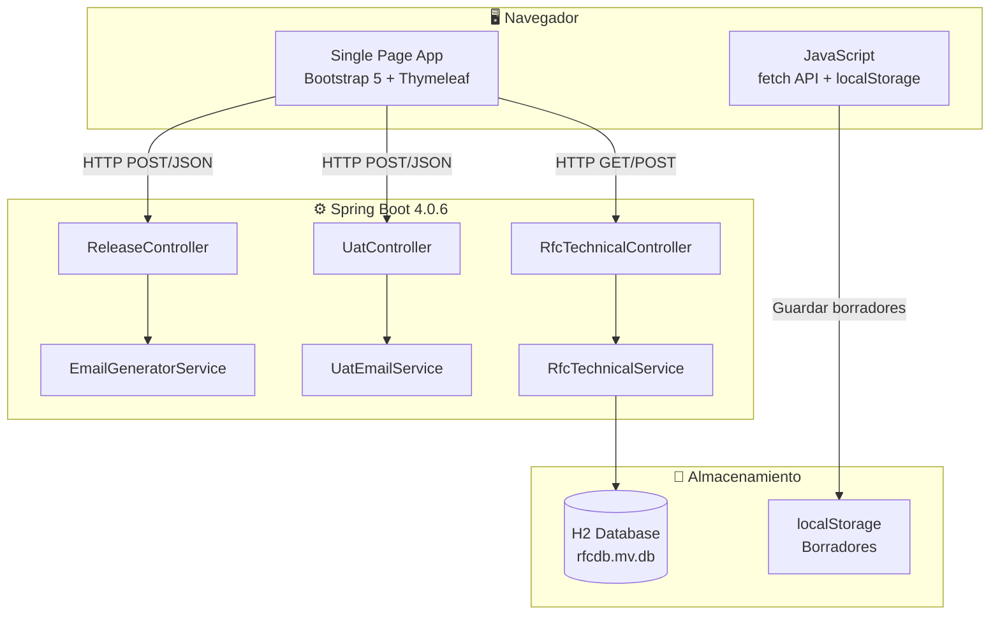
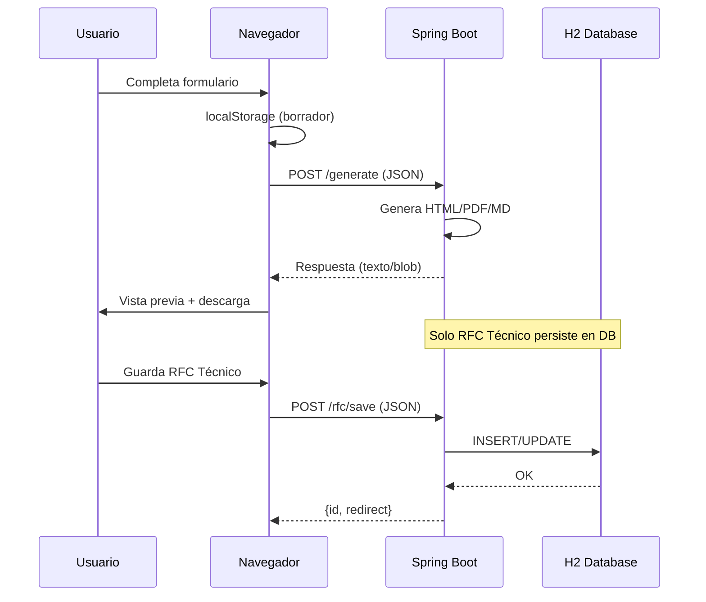
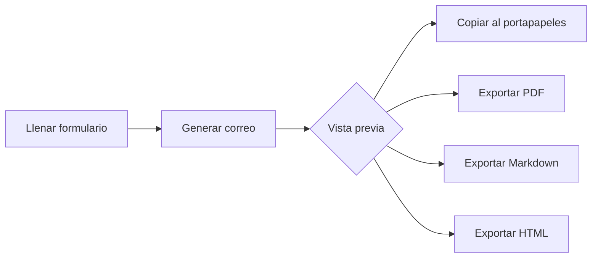
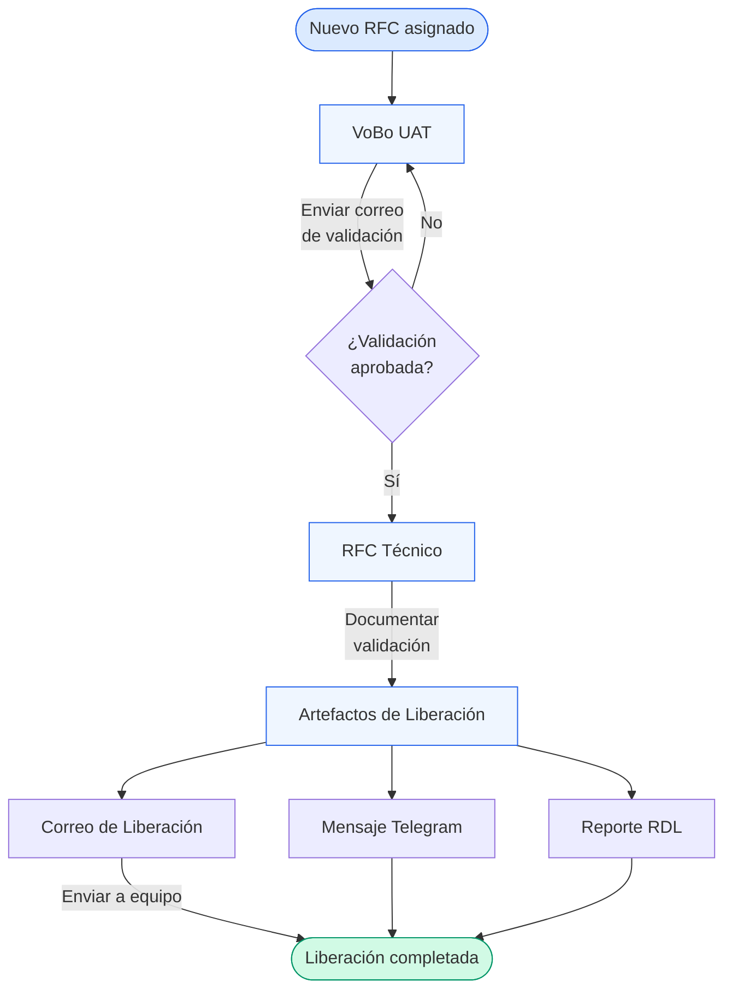
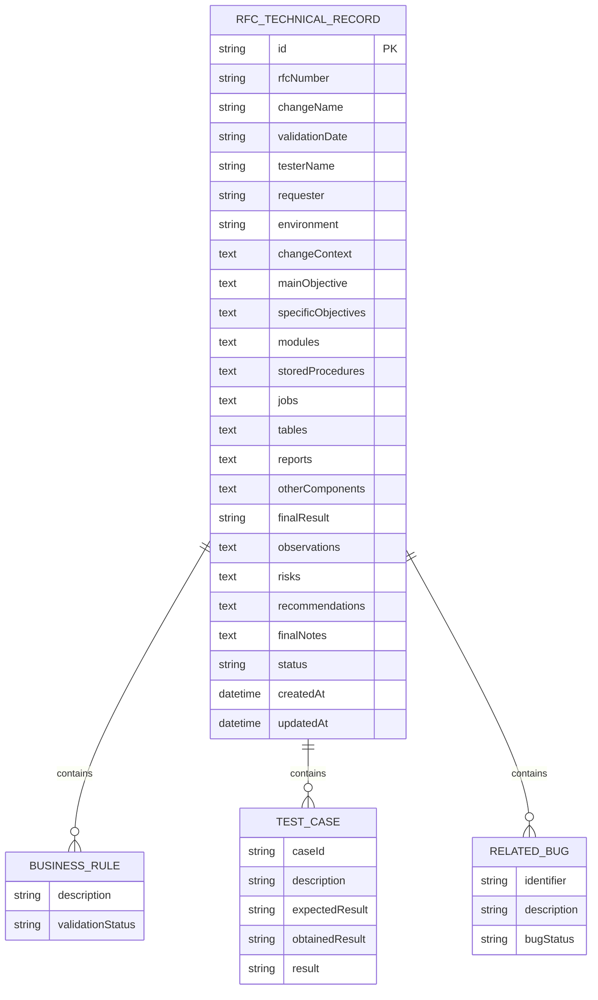
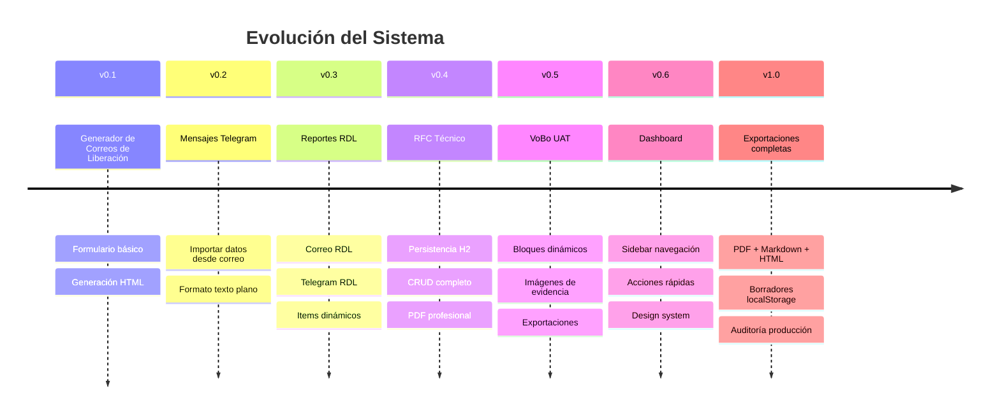

<p align="center">
  
</p>

<h1 align="center">Release Notifier QA</h1>

<p align="center">
  <strong>Plataforma integral de gestión de liberaciones y validación QA</strong>
</p>

<p align="center">
  
  
  
  
</p>

---

| | |
|---|---|
| **Autor** | Pablo Eduardo López Ontiveros |
| **Organización** | Megacable — Equipo QA |
| **Fecha** | Junio 2026 |
| **Versión** | 1.0.0 |
| **Repositorio** | [github.com/pabloloz/release-mail-generator](https://github.com/pabloloz/release-mail-generator) |

---

## Tabla de Contenidos

- [Descripción General](#descripción-general)
- [Arquitectura](#arquitectura)
- [Módulos del Sistema](#módulos-del-sistema)
- [Flujo Completo](#flujo-completo-del-sistema)
- [Manual de Usuario](#manual-de-usuario)
- [Modelo de Datos](#modelo-de-datos)
- [API y Backend](#api-y-backend)
- [Estructura del Proyecto](#estructura-del-proyecto)
- [Exportaciones](#exportaciones)
- [Configuración e Instalación](#configuración-e-instalación)
- [Historial y Evolución](#historial-y-evolución)
- [Roadmap](#roadmap)
- [Calidad del Código](#calidad-del-código)
- [Apéndices](#apéndices)

---

## Descripción General

### ¿Qué problema resuelve?

El equipo de QA y liberaciones genera diariamente correos técnicos, reportes de distribución (RDL), mensajes de Telegram y documentos de validación UAT. Antes de esta plataforma, todo se redactaba **manualmente** en Outlook, provocando:

- Errores de formato y datos inconsistentes.
- Tiempo perdido copiando rutas, versiones y tickets.
- Falta de estandarización entre los miembros del equipo.
- Ausencia de trazabilidad documental.

**Release Notifier QA** automatiza la generación de todos estos artefactos desde una interfaz unificada, garantizando consistencia, velocidad y profesionalismo en cada comunicación.

### Público objetivo

| Rol | Uso principal |
|-----|---------------|
| Analista QA | Crear VoBo UAT, RFC Técnico |
| Líder de liberaciones | Generar correos y mensajes de Telegram |
| Equipo de distribución | Consultar reportes RDL |
| Gestión de cambios | Exportar documentación técnica |

### Beneficios

- ⚡ **Velocidad** — De 15-20 min manuales a menos de 2 min por artefacto.
- 🎯 **Consistencia** — Formato corporativo unificado en toda comunicación.
- 📦 **Multi-formato** — Exportación simultánea a PDF, Markdown y HTML.
- 🔄 **Reutilización** — Importar datos entre módulos (Correo → Telegram).
- 💾 **Persistencia** — Borradores en localStorage + RFC guardados en base de datos.

### Alcance

La plataforma cubre el ciclo completo de documentación de una liberación:

```
RFC → VoBo UAT → Validación → RFC Técnico → Artefactos → Correo + Telegram
```

---

## Arquitectura

### Stack tecnológico

| Capa | Tecnología | Versión |
|------|-----------|---------|
| **Runtime** | Java | 17 |
| **Framework** | Spring Boot | 4.0.6 |
| **Template Engine** | Thymeleaf | (incluido) |
| **Frontend** | Bootstrap 5 + CSS custom | 5.3.3 |
| **Base de datos** | H2 (embedded, file-based) | (incluido) |
| **ORM** | Hibernate / JPA | (incluido) |
| **PDF** | OpenPDF (LibrePDF) | 1.3.43 |
| **Build** | Maven Wrapper | — |
| **Containerización** | Docker (multi-stage) | — |
| **Fuente** | Inter (Google Fonts) | — |

### Diagrama de arquitectura



### Flujo general de información



---

## Módulos del Sistema

### 1. Artefactos y Correos de Liberación

> **Propósito**: Generar correos HTML formateados para notificar al equipo sobre una nueva liberación de software.

#### Campos del formulario

| Sección | Campo | Tipo | Descripción |
|---------|-------|------|-------------|
| Versiones | Versión a publicar | Segmentado (3 campos) | Formato `AA.S.PP` (año.semana.patch) |
| Versiones | Versión rollback | Segmentado (3 campos) | Versión anterior para revertir |
| Publicación | Fecha de publicación | Date | Fecha planificada |
| Publicación | URL de release | URL | Enlace al paquete |
| Artefactos | Módulos | Checkbox + selección | Cartera, Servicios, Control, etc. |
| Artefactos | Citrix | Checkbox | Incluye distribución Citrix |
| Artefactos | DLL | Checkbox | Incluye DLL C# |
| Artefactos | WinterX | Checkbox | Incluye WinterX |
| Artefactos | Scripts SQL | Checkbox + texto | Scripts a ejecutar |
| Branches | Branch Módulos | Texto | Nombre del branch |
| Branches | Branch WinterX | Texto | Branch de WinterX |
| Complementos | SPs / Tickets | Textarea | Stored procedures |
| Complementos | Proyectos / RFCs | Textarea | RFCs asociados |
| Complementos | Notas | Textarea | Instrucciones especiales |

#### Flujo de uso



#### Exportaciones disponibles

- **PDF** — Documento profesional con encabezados corporativos.
- **Markdown** — Para documentación en repositorios.
- **HTML** — Para respaldo o envío directo.
- **Portapapeles** — Copia el HTML formateado para pegar en Outlook.

---

### 2. Mensaje de Telegram

> **Propósito**: Generar mensajes formateados para el grupo de Telegram del equipo de infraestructura.

#### Características

- Importa datos automáticamente desde el formulario de correo.
- Formato texto plano optimizado para Telegram.
- Incluye: acción, scripts, versiones, cambios, branches y rollback.
- Módulos permitidos: Cartera, Servicios, Control, Hightech, Equipos, Ventas, Citrix, DLL, WinterX, DLL C#.

#### Ejemplo de salida

```
Acción: actualizar módulos Cartera, Servicios, Control

Ejecutar scripts:
SP_ActualizarPromociones.sql
SP_LimpiarCache.sql

Publicar: 22/06/2026
Versión Módulo: 26.6.18
Versión DLL C#: 26.6.11.2

Cambios Reléase
RFC-24269 Promociones combinen con 120 Mbps
RFC-24301 Ajuste de tarifas zona norte

Versión Rollback: 26.6.17

Branch compilación Modulos: release/26.6.18
```

---

### 3. Reportes RDL (Reporte de Distribución de Liberación)

> **Propósito**: Documentar los reportes, stored procedures y proyectos que se distribuyen con cada liberación.

#### Estructura de un item RDL

| Campo | Descripción |
|-------|-------------|
| Nombre del reporte | Identificador del RDL |
| Carpeta | Ubicación del reporte |
| URL Megang | Enlace en servidor Megang |
| URL NTRS02 | Enlace en servidor NTRS02 |
| Path Megang | Ruta física Megang |
| Path NTRS02 | Ruta física NTRS02 |
| ¿Tiene SP? | Checkbox |
| SP Name | Nombre del stored procedure |
| SP Ticket | Ticket asociado |
| Proyecto | Proyecto/RFC relacionado |

#### Exportaciones

- Correo HTML con tabla formateada.
- Mensaje Telegram con formato texto.
- PDF con tabla estructurada.
- Markdown para documentación.

---

### 4. RFC Técnico

> **Propósito**: Documentar formalmente la validación técnica de un RFC (Request for Change) incluyendo contexto, objetivos, componentes, reglas de negocio, casos de prueba y conclusiones.

#### Secciones del formulario

1. **Información general** — RFC, nombre del cambio, fecha, tester, solicitante, ambiente.
2. **Contexto del cambio** — Descripción detallada.
3. **Objetivos** — General y específicos.
4. **Componentes técnicos** — Módulos, SPs, jobs, tablas, reportes, otros.
5. **Reglas de negocio** — Lista con estado de validación.
6. **Casos de prueba** — ID, descripción, resultado esperado, obtenido, veredicto.
7. **Bugs relacionados** — Identificador, descripción, estado.
8. **Conclusiones** — Resultado final, observaciones, riesgos, recomendaciones.
9. **Notas finales** — Observaciones adicionales.

#### Persistencia

- Los registros se guardan en base de datos H2.
- Se asigna un ID único por registro.
- Soporta CRUD completo (crear, leer, editar, eliminar).
- Se exporta a PDF y Markdown.

---

### 5. VoBo UAT (Visto Bueno de User Acceptance Testing)

> **Propósito**: Generar correos de solicitud de validación UAT con formato corporativo, incluyendo pasos, evidencias y requerimientos.

#### Campos

| Campo | Tipo | Descripción |
|-------|------|-------------|
| RFC Number | Texto | Número del RFC |
| RFC Name | Texto | Descripción corta |
| Saludo | Texto | Saludo personalizable |
| Adjunto | Texto | Texto sobre documentación adjunta |
| Requerimientos | Textarea | Condiciones a validar |
| Imagen requerimientos | Archivo | Captura de pantalla |
| Bloques dinámicos | Repetibles | Texto + imagen de evidencia |
| Nota | Textarea | Nota especial |
| Cierre | Texto | Despedida personalizable |

#### Bloques dinámicos

Se pueden agregar N bloques con:
- Texto descriptivo del paso o validación.
- Imagen de evidencia (captura de pantalla).

#### Exportaciones

- HTML (vista previa y portapapeles).
- PDF con imágenes embebidas.
- Markdown.

---

## Flujo Completo del Sistema



### Descripción del flujo

| Paso | Módulo | Acción | Resultado |
|------|--------|--------|-----------|
| 1 | VoBo UAT | Crear solicitud de validación | Correo a usuarios finales |
| 2 | — | Usuarios validan en ambiente UAT | Aprobación/Rechazo |
| 3 | RFC Técnico | Documentar resultados técnicos | Registro persistente |
| 4 | Artefactos | Generar correo de liberación | HTML formateado |
| 5 | Artefactos | Generar mensaje Telegram | Texto para grupo |
| 6 | RDL | Documentar distribución | Reporte técnico |

---

## Manual de Usuario

### Acceso al sistema

1. Navegar a `http://localhost:8080` (desarrollo) o la URL de producción.
2. El sistema muestra el **Dashboard principal** con accesos rápidos.

### Dashboard

El dashboard presenta:
- Tarjetas de resumen por módulo.
- Botones de acceso rápido a cada funcionalidad.
- Navegación lateral (sidebar) siempre visible.

### Crear un Correo de Liberación

1. Click en **"Artefactos / Correo de liberación"** en el sidebar o dashboard.
2. Completar los campos de versión (3 segmentos: año, semana, patch).
3. Marcar los artefactos a distribuir (Módulos, Citrix, DLL, etc.).
4. Rellenar rutas, branches y scripts SQL.
5. Click en **"Generar Correo →"**.
6. En la vista previa: copiar, exportar PDF, Markdown o HTML.

### Crear un Mensaje de Telegram

1. Click en **"Artefactos / Telegram"** en el sidebar.
2. Click en **"📥 Importar datos desde Correo de Liberación"** para auto-completar.
3. Ajustar módulos, scripts y notas si es necesario.
4. Click en **"Generar Mensaje →"**.
5. Copiar al portapapeles y pegar en Telegram.

### Crear un Reporte RDL

1. Click en **"RDL / Correo"** en el sidebar.
2. Agregar items con **"+ Agregar RDL"**.
3. Completar nombre, carpeta, URLs y paths de cada reporte.
4. Click en **"Generar Correo RDL →"**.
5. Exportar o copiar según necesidad.

### Crear un RFC Técnico

1. Click en **"RFC Técnico"** en el sidebar.
2. Click en **"Nuevo RFC"**.
3. Completar todas las secciones del formulario.
4. Click en **"Guardar"** — se persiste en base de datos.
5. Desde la vista de detalle: exportar a PDF o Markdown.

### Crear un VoBo UAT

1. Click en **"VoBo UAT"** en el sidebar.
2. Completar RFC, nombre, requerimientos.
3. Agregar bloques dinámicos con texto + imágenes.
4. Click en **"Generar Correo UAT →"**.
5. Copiar al portapapeles para Outlook.

### Buenas prácticas

- ✅ Completar la versión primero — las rutas se auto-calculan.
- ✅ Usar "Importar datos" entre módulos para evitar re-tipeo.
- ✅ Los borradores se guardan automáticamente en el navegador.
- ✅ Exportar en múltiples formatos para respaldo.
- ⚠️ Las imágenes en VoBo UAT deben ser < 2MB para correos corporativos.

---

## Modelo de Datos

### Diagrama entidad-relación



### Entidades

#### `RfcTechnicalRecord` (Persistida en H2)

La única entidad con persistencia en base de datos. Almacena la documentación técnica completa de un RFC.

| Campo | Tipo | Descripción |
|-------|------|-------------|
| `id` | `String` (PK) | UUID generado en cliente |
| `rfcNumber` | `String` | Número de RFC (ej: "RFC 24269") |
| `changeName` | `String` | Nombre descriptivo del cambio |
| `validationDate` | `String` | Fecha de validación |
| `testerName` | `String` | Nombre del tester |
| `requester` | `String` | Quien solicita el cambio |
| `environment` | `String` | Ambiente de validación |
| `changeContext` | `TEXT` | Contexto detallado |
| `mainObjective` | `TEXT` | Objetivo principal |
| `specificObjectives` | `TEXT` | Objetivos específicos |
| `modules` | `TEXT` | Módulos involucrados |
| `storedProcedures` | `TEXT` | SPs modificados |
| `jobs` | `TEXT` | Jobs afectados |
| `tables` | `TEXT` | Tablas impactadas |
| `reports` | `TEXT` | Reportes relacionados |
| `otherComponents` | `TEXT` | Otros componentes |
| `businessRules` | `TEXT` (JSON) | Lista de reglas de negocio |
| `testCases` | `TEXT` (JSON) | Lista de casos de prueba |
| `relatedBugs` | `TEXT` (JSON) | Bugs relacionados |
| `finalResult` | `String` | Resultado (Aprobado/Rechazado) |
| `observations` | `TEXT` | Observaciones |
| `risks` | `TEXT` | Riesgos identificados |
| `recommendations` | `TEXT` | Recomendaciones |
| `finalNotes` | `TEXT` | Notas finales |
| `status` | `String` | Estado del registro |
| `createdAt` | `LocalDateTime` | Fecha de creación |
| `updatedAt` | `LocalDateTime` | Última modificación |

#### Modelos transitorios (sin persistencia)

| Modelo | Propósito |
|--------|-----------|
| `ReleaseRequest` | Datos del correo de liberación |
| `RdlReleaseRequest` | Datos del reporte RDL |
| `RdlItem` | Un ítem individual del RDL |
| `UatRequest` | Datos del correo VoBo UAT |
| `UatBlock` | Bloque dinámico (texto + imagen) |
| `BusinessRule` | Regla de negocio (embebida en RFC) |
| `TestCase` | Caso de prueba (embebido en RFC) |
| `RelatedBug` | Bug relacionado (embebido en RFC) |

---

## API y Backend

### Controllers

#### `ReleaseController`

| Método | Endpoint | Content-Type | Descripción |
|--------|----------|-------------|-------------|
| `GET` | `/` | `text/html` | Dashboard principal |
| `POST` | `/generate` | `form-data` | Generar correo (form submit) |
| `POST` | `/generate-release-message` | `application/json` → `text/plain` | Generar mensaje Telegram |
| `POST` | `/generate-rdl` | `application/json` → `text/html` | Generar correo RDL |
| `POST` | `/generate-rdl-message` | `application/json` → `text/plain` | Generar mensaje Telegram RDL |
| `POST` | `/release/export/pdf` | `application/json` → `application/pdf` | Exportar liberación PDF |
| `POST` | `/release/export/markdown` | `application/json` → `text/markdown` | Exportar liberación MD |
| `POST` | `/release/export/html` | `application/json` → `text/html` | Exportar liberación HTML |
| `POST` | `/rdl/export/pdf` | `application/json` → `application/pdf` | Exportar RDL PDF |
| `POST` | `/rdl/export/markdown` | `application/json` → `text/markdown` | Exportar RDL MD |
| `POST` | `/rdl/export/html` | `application/json` → `text/html` | Exportar RDL HTML |

#### `UatController`

| Método | Endpoint | Content-Type | Descripción |
|--------|----------|-------------|-------------|
| `GET` | `/uat` | — | Redirect a `/` |
| `POST` | `/generate-uat` | `application/json` → `text/html` | Generar correo UAT |
| `POST` | `/uat/export/pdf` | `application/json` → `application/pdf` | Exportar UAT PDF |
| `POST` | `/uat/export/markdown` | `application/json` → `text/markdown` | Exportar UAT MD |
| `POST` | `/uat/export/html` | `application/json` → `text/html` | Exportar UAT HTML |

#### `RfcTechnicalController`

| Método | Endpoint | Content-Type | Descripción |
|--------|----------|-------------|-------------|
| `GET` | `/rfc` | `text/html` | Listado de RFCs |
| `GET` | `/rfc/new` | `text/html` | Formulario nuevo RFC |
| `GET` | `/rfc/{id}` | `text/html` | Vista detalle RFC |
| `GET` | `/rfc/{id}/edit` | `text/html` | Formulario edición |
| `POST` | `/rfc/save` | `application/json` | Guardar/Actualizar RFC |
| `GET` | `/rfc/{id}/pdf` | `application/pdf` | Descargar PDF |
| `GET` | `/rfc/{id}/markdown` | `text/markdown` | Descargar Markdown |
| `POST` | `/rfc/{id}/delete` | — | Eliminar RFC |

### Services

| Servicio | Responsabilidad |
|----------|----------------|
| `EmailGeneratorService` | Genera correos HTML, mensajes Telegram, PDFs y Markdowns para liberaciones y RDL |
| `UatEmailService` | Genera correos, PDFs y Markdowns para VoBo UAT |
| `RfcTechnicalService` | CRUD de registros RFC + generación PDF/Markdown |

### Ejemplo de request

```json
// POST /generate-release-message
{
  "version": "26.6.18",
  "rollbackVersion": "26.6.17",
  "publishDate": "2026-06-22",
  "hasModules": true,
  "hasCitrix": false,
  "hasDll": true,
  "hasWinterX": false,
  "hasScripts": true,
  "distributionModules": ["Cartera", "Servicios"],
  "scripts": "SP_Actualizar.sql\nSP_Limpiar.sql",
  "branchModules": "release/26.6.18",
  "projects": "RFC-24269 Promociones\nRFC-24301 Tarifas",
  "telegramModules": ["Cartera", "Servicios", "DLL"]
}
```

---

## Estructura del Proyecto

```
release-mail-generator/
├── docs/                          # 📚 Documentación
├── src/
│   ├── main/
│   │   ├── java/release_mail_generator/
│   │   │   ├── ReleaseMailGeneratorApplication.java   # Entry point
│   │   │   ├── controller/
│   │   │   │   ├── ReleaseController.java            # Liberaciones + RDL
│   │   │   │   ├── RfcTechnicalController.java       # RFC Técnico (CRUD)
│   │   │   │   └── UatController.java                # VoBo UAT
│   │   │   ├── converter/
│   │   │   │   ├── BusinessRuleListConverter.java     # JSON ↔ List<BusinessRule>
│   │   │   │   ├── RelatedBugListConverter.java       # JSON ↔ List<RelatedBug>
│   │   │   │   └── TestCaseListConverter.java         # JSON ↔ List<TestCase>
│   │   │   ├── model/
│   │   │   │   ├── BusinessRule.java                  # Regla de negocio
│   │   │   │   ├── RdlItem.java                      # Ítem RDL individual
│   │   │   │   ├── RdlReleaseRequest.java            # Request RDL completo
│   │   │   │   ├── RelatedBug.java                   # Bug relacionado
│   │   │   │   ├── ReleaseRequest.java               # Request liberación
│   │   │   │   ├── RfcTechnicalRecord.java           # Entidad JPA (RFC)
│   │   │   │   ├── TestCase.java                     # Caso de prueba
│   │   │   │   ├── UatBlock.java                     # Bloque UAT
│   │   │   │   └── UatRequest.java                   # Request UAT
│   │   │   ├── repository/
│   │   │   │   └── RfcTechnicalRepository.java       # JPA Repository
│   │   │   └── service/
│   │   │       ├── EmailGeneratorService.java        # Generador liberaciones
│   │   │       ├── RfcTechnicalService.java          # Lógica RFC + PDF/MD
│   │   │       └── UatEmailService.java              # Generador UAT
│   │   └── resources/
│   │       ├── application.properties                # Config base
│   │       ├── application-dev.properties            # Config desarrollo
│   │       ├── application-prod.properties           # Config producción
│   │       ├── static/
│   │       │   ├── css/app.css                       # Estilos adicionales
│   │       │   └── images/                           # Imágenes estáticas
│   │       └── templates/
│   │           ├── index.html                        # SPA principal (~2300 líneas)
│   │           ├── rfc-form.html                     # Formulario RFC
│   │           ├── rfc-list.html                     # Lista de RFCs
│   │           ├── rfc-view.html                     # Vista detalle RFC
│   │           └── uat-form.html                     # (legacy, UAT vive en index)
│   └── test/
│       └── java/release_mail_generator/
│           └── ReleaseMailGeneratorApplicationTests.java
├── data/                          # H2 database files (gitignored)
├── Dockerfile                     # Multi-stage build
├── pom.xml                        # Maven dependencies
├── mvnw / mvnw.cmd                # Maven wrapper
└── README.md
```

### Convenciones

| Convención | Descripción |
|------------|-------------|
| Paquetes | `controller`, `service`, `model`, `repository`, `converter` |
| Naming | CamelCase para clases, camelCase para métodos y campos |
| DTOs | Modelos `*Request` son transitorios (sin `@Entity`) |
| Persistencia | Solo `RfcTechnicalRecord` tiene `@Entity` |
| JSON ↔ JPA | Converters en `converter/` para listas embebidas |
| Templates | Thymeleaf con fragmentos incrustados en `index.html` |

---

## Exportaciones

### Formatos soportados por módulo

| Módulo | HTML | PDF | Markdown | Portapapeles |
|--------|:----:|:---:|:--------:|:------------:|
| Correo liberación | ✅ | ✅ | ✅ | ✅ |
| Mensaje Telegram | — | — | — | ✅ |
| Correo RDL | ✅ | ✅ | ✅ | ✅ |
| Telegram RDL | — | — | — | ✅ |
| VoBo UAT | ✅ | ✅ | ✅ | ✅ |
| RFC Técnico | — | ✅ | ✅ | — |

### Características de los PDFs

- Generados con **OpenPDF** (fork de iText 2.1).
- Encabezado corporativo con nombre del documento.
- Pie de página con número de página y timestamp.
- Paleta de colores corporativa (azul primario #2563eb).
- Tipografía Helvetica con jerarquía de tamaños.
- Tablas con bordes sutiles y filas alternadas.

### Características del Markdown

- Compatible con GitHub Flavored Markdown.
- Incluye tablas, listas y encabezados jerárquicos.
- Footer con timestamp de generación.
- Apto para publicar en wikis o repositorios.

---

## Configuración e Instalación

### Requisitos previos

| Requisito | Versión mínima |
|-----------|---------------|
| Java JDK | 17+ |
| Maven | 3.8+ (incluido via wrapper) |
| Docker | 20+ (opcional) |
| Puerto disponible | 8080 |

### Ejecución local

```bash
# Clonar repositorio
git clone https://github.com/pabloloz/release-mail-generator.git
cd release-mail-generator/release-mail-generator

# Ejecutar en desarrollo
./mvnw spring-boot:run -Dspring-boot.run.profiles=dev

# O en Windows
.\mvnw.cmd spring-boot:run -Dspring-boot.run.profiles=dev
```

### Compilación

```bash
# Compilar sin tests
./mvnw clean package -DskipTests

# El JAR se genera en target/app.jar
java -jar target/app.jar
```

### Docker

```bash
# Construir imagen
docker build -t release-notifier-qa .

# Ejecutar
docker run -p 8080:8080 release-notifier-qa

# Con volumen para persistencia
docker run -p 8080:8080 -v rfcdata:/app/data release-notifier-qa
```

### Variables de entorno

| Variable | Default | Descripción |
|----------|---------|-------------|
| `PORT` | `8080` | Puerto del servidor |
| `SPRING_PROFILES_ACTIVE` | — | `dev` o `prod` |

### Perfiles

| Perfil | Thymeleaf cache | H2 Console | SQL logs |
|--------|:-:|:-:|:-:|
| `dev` | ❌ | ✅ (`/h2-console`) | ✅ |
| `prod` | ✅ | ❌ | ❌ |

---

## Historial y Evolución



---

## Roadmap

### Corto plazo (Q3 2026)

- [ ] Integración con **Microsoft Teams** — Enviar artefactos directamente.
- [ ] **Historial de versiones** — Log de todas las liberaciones generadas.
- [ ] **Templates personalizables** — Configurar formato de correos.

### Mediano plazo (Q4 2026)

- [ ] Integración con **Jira** — Importar RFCs y tickets automáticamente.
- [ ] **Autenticación LDAP** — Single sign-on corporativo.
- [ ] **Roles y permisos** — Admin, QA Lead, Analyst.
- [ ] **Dashboard con métricas** — Liberaciones por semana, módulos más activos.

### Largo plazo (2027)

- [ ] **Integración con Outlook** — Envío directo sin copiar/pegar.
- [ ] **Gestión de evidencias** — Repositorio centralizado de screenshots.
- [ ] **Pipeline CI/CD** — Auto-generar artefactos desde Jenkins/GitHub Actions.
- [ ] **API REST pública** — Para integración con sistemas externos.
- [ ] **Migración a PostgreSQL** — Para entornos multi-usuario.

---

## Calidad del Código

### Arquitectura

| Aspecto | Evaluación | Nota |
|---------|:----------:|------|
| Separación de capas | ⭐⭐⭐⭐ | Controller → Service → Repository bien definido |
| Single Responsibility | ⭐⭐⭐⭐ | Cada servicio tiene un propósito claro |
| DRY | ⭐⭐⭐ | Helpers compartidos, algo de duplicación en PDF |
| Seguridad | ⭐⭐⭐⭐ | XSS guards, data URI validation, input sanitization |
| Testabilidad | ⭐⭐ | Falta cobertura de tests unitarios |

### Patrones utilizados

- **MVC** — Spring MVC con Thymeleaf.
- **Repository Pattern** — JPA Repository para RFC.
- **Service Layer** — Lógica de negocio separada de controllers.
- **DTO Pattern** — Modelos `*Request` como Data Transfer Objects.
- **Converter Pattern** — JPA AttributeConverters para JSON embebido.
- **Builder Pattern** — StringBuilder para generación HTML/texto.

### Áreas de mejora sugeridas

1. **Extraer JS a archivo separado** — `index.html` tiene ~2300 líneas con CSS+JS embebido.
2. **Tests unitarios** — Agregar tests para services (generación PDF, Markdown, HTML).
3. **Validación de entrada** — Agregar `@Valid` + Bean Validation en controllers.
4. **Manejo de errores global** — `@ControllerAdvice` para errores unificados.
5. **Internacionalización** — Preparar para i18n si se escala a otros equipos.

---

## Apéndices

### Glosario

| Término | Definición |
|---------|-----------|
| **RFC** | Request for Change — Solicitud formal de cambio en sistemas |
| **RDL** | Reporte de Distribución de Liberación |
| **VoBo** | Visto Bueno — Aprobación formal |
| **UAT** | User Acceptance Testing — Pruebas de aceptación |
| **SP** | Stored Procedure — Procedimiento almacenado en BD |
| **Branch** | Rama de código en control de versiones |
| **Rollback** | Reversión a versión anterior |
| **Artefacto** | Componente distribuible de software |

### Acrónimos

| Sigla | Significado |
|-------|-------------|
| QA | Quality Assurance |
| UAT | User Acceptance Testing |
| RFC | Request for Change |
| RDL | Reporte de Distribución de Liberación |
| SPA | Single Page Application |
| JPA | Java Persistence API |
| ORM | Object-Relational Mapping |
| DTO | Data Transfer Object |
| CRUD | Create, Read, Update, Delete |
| CI/CD | Continuous Integration / Continuous Delivery |

### Convenciones de versionado

El sistema usa versionado semántico para liberaciones:

```
AA.SS.PP

AA = Año (2 dígitos)
SS = Semana del año
PP = Patch/secuencial
```

**Ejemplo**: `26.6.18` = Año 2026, semana 6, patch 18.

### Preguntas frecuentes

<details>
<summary><strong>¿Dónde se guardan los datos de RFC Técnico?</strong></summary>

En una base de datos H2 embebida, almacenada en `./data/rfcdb.mv.db`. Los datos persisten entre reinicios del servidor.
</details>

<details>
<summary><strong>¿Se pierden los borradores al cerrar el navegador?</strong></summary>

No. Los borradores se almacenan en `localStorage` del navegador y se restauran al volver a abrir la aplicación.
</details>

<details>
<summary><strong>¿Puedo usar la aplicación sin conexión a internet?</strong></summary>

Sí, excepto por la fuente Inter que se carga desde Google Fonts. Toda la lógica funciona localmente.
</details>

<details>
<summary><strong>¿Cómo exporto un correo a Outlook?</strong></summary>

Click en "Copiar" → abrir Outlook → nuevo correo → Ctrl+V. El HTML formateado se pega directamente.
</details>

<details>
<summary><strong>¿Qué navegadores están soportados?</strong></summary>

Chrome 90+, Edge 90+, Firefox 88+, Safari 14+. Se recomienda Chrome o Edge para mejor compatibilidad con `clipboard API`.
</details>

---

<p align="center">
  <sub>Documentación generada el 22 de junio de 2026 — Release Notifier QA v1.0.0</sub>
</p>
